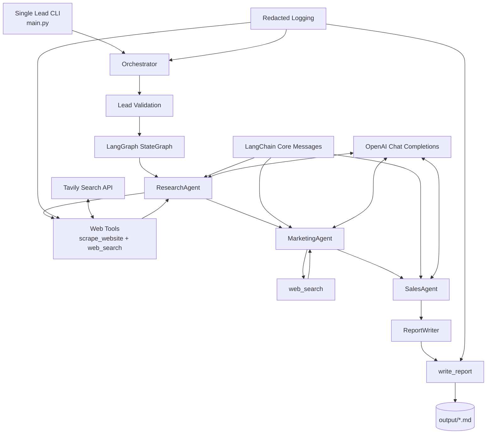

# Architecture

## System Diagram

## Flow
1. A sales operator provides a company name and optional website URL.
2. `Orchestrator` validates the lead and initializes `OutreachState`.
3. LangGraph runs research, marketing, sales, and report nodes in order.
4. Specialist agents build LangChain messages and call the LLM and approved tools as needed.
5. `ReportWriter` formats the completed state and `write_report` writes the Markdown file under `output/`.
6. Redacted logging records workflow status without storing prompts, report bodies, tool payloads, or secrets.

## Boundaries
- `agents/` owns business workflow behavior.
- `lib/` owns reusable primitives such as LangChain messages, tools, memory, secure logging, LLM calls, and workflow results.
- `tools/` owns external side effects.
- `tests/` verifies business logic without live API calls.
