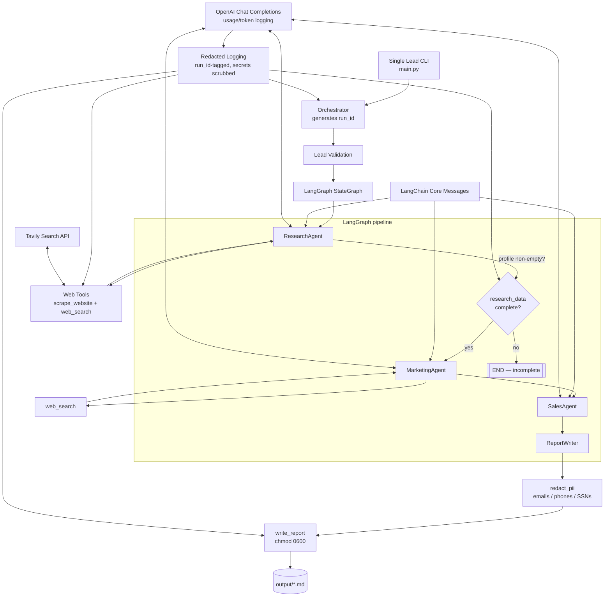

# Architecture

## System Diagram

## Flow
1. A sales operator provides a company name and optional website URL.
2. `Orchestrator` validates the lead, mints a `run_id` (UUID4), and initializes `OutreachState` with it — every subsequent log line for the run carries that id.
3. LangGraph runs research, then a conditional edge checks `research_data.profile` before advancing: an empty profile routes straight to `END` (`pipeline_step_incomplete`) instead of continuing into marketing/sales with unusable data.
4. On a complete profile, marketing, sales, and report nodes run in order.
5. Specialist agents build LangChain messages and call the LLM and approved tools as needed; each LLM call logs prompt/completion/total token usage.
6. `ReportWriter` formats the completed state, redacts incidental PII (emails, phone numbers, SSN-like patterns — not decision-maker names/titles, which are the report's purpose) from the Markdown, and `write_report` writes it under `output/` with owner-only (`0600`) permissions.
7. Redacted logging records workflow status, run id, and token usage without storing prompts, report bodies, tool payloads, or secrets.

## Boundaries
- `agents/` owns business workflow behavior.
- `lib/` owns reusable primitives such as LangChain messages, tools, memory, secure logging, PII redaction, LLM calls, and workflow results.
- `tools/` owns external side effects.
- `tests/` verifies business logic without live API calls.
