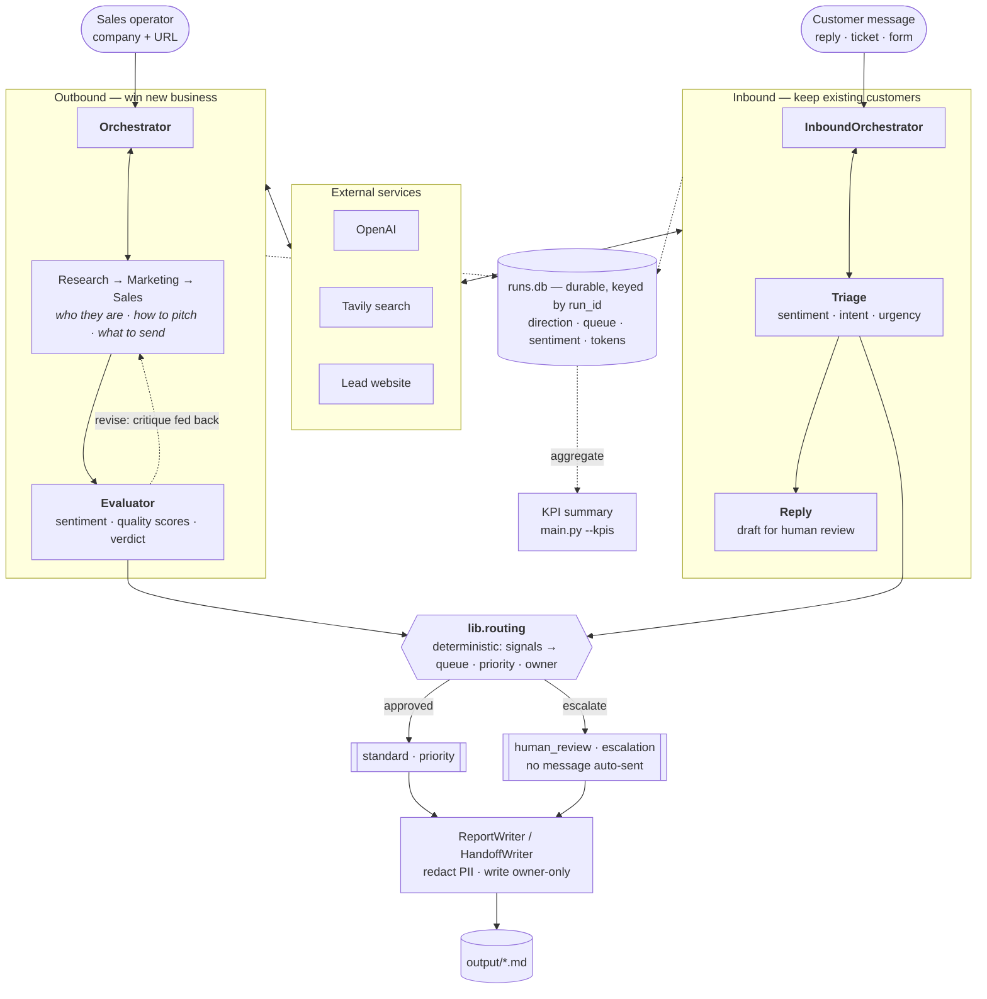
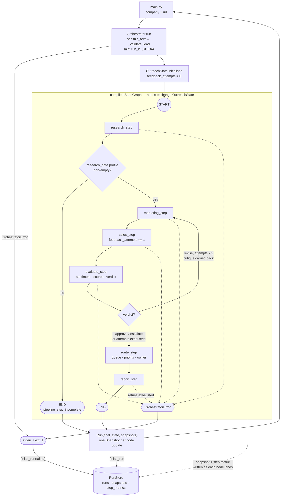
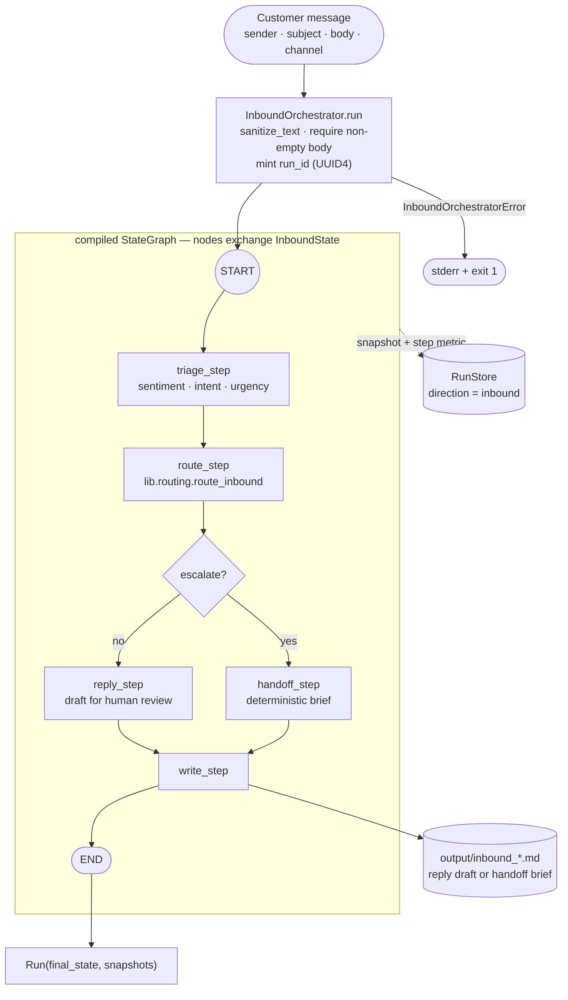
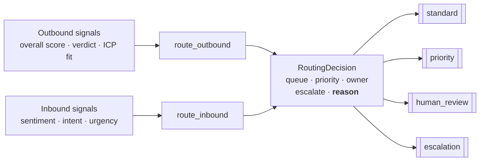
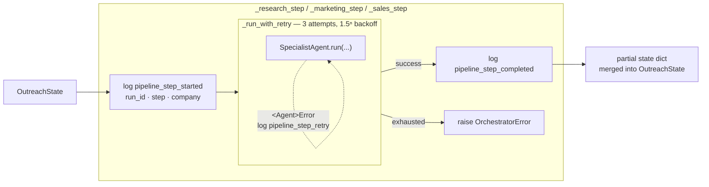
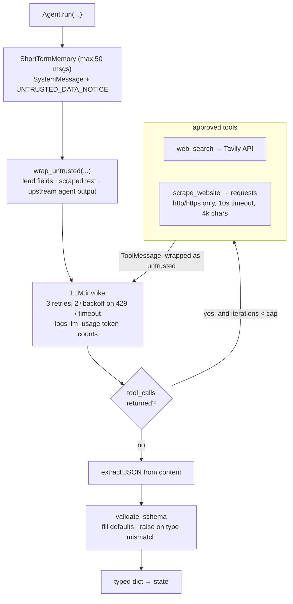
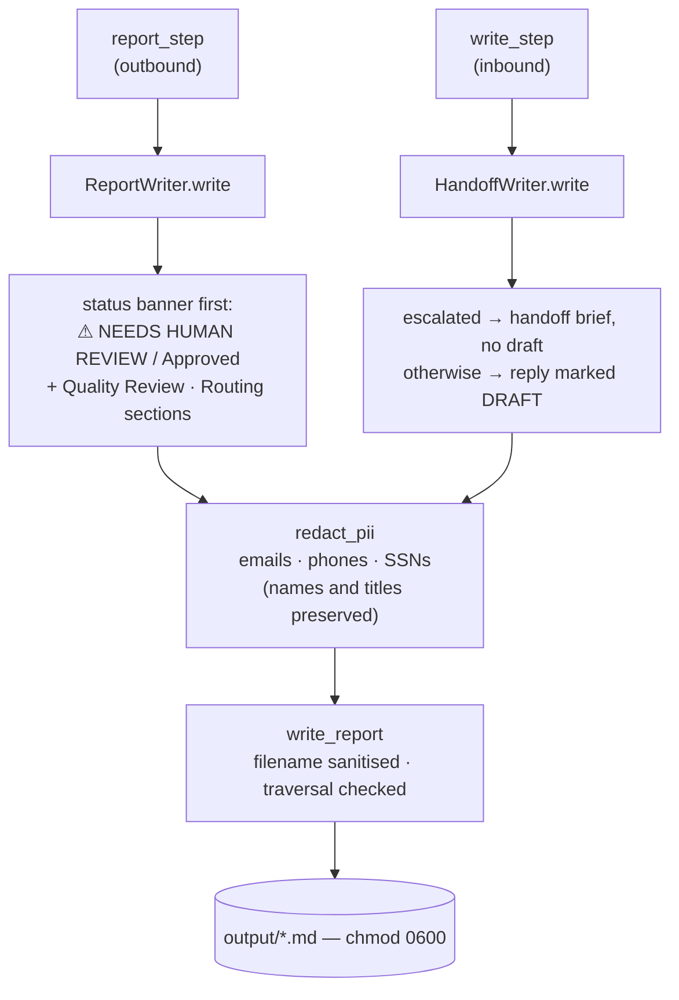
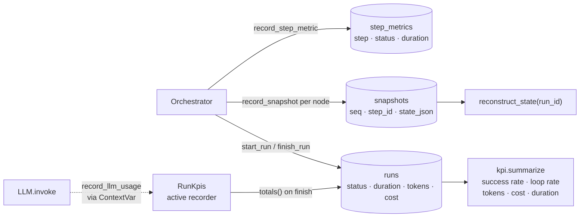
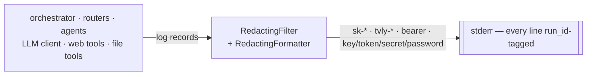
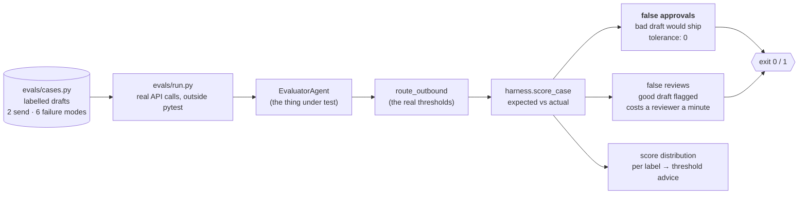

# Architecture

## Overview

Two pipelines over a shared spine. **Outbound** researches a lead and produces
reviewed outreach; **inbound** triages a customer message and routes it to an
owner. Both are LangGraph state machines driven by an orchestrator that wraps
pure agents with logging, bounded retry, and error translation, and both end at
the same deterministic routing layer.

No generated message is ever sent automatically. Outbound drafts are scored and
either queued or handed to a human; inbound replies are drafts a person reviews,
and escalated messages get no draft at all.



Everything below drills into one band of this picture: the graph the Orchestrator
compiles, what a single node does, what happens inside a specialist, how the
report is written, and how logging cuts across all of it.

## Outbound pipeline topology

Every node reads and writes a single typed `OutreachState` ([`agents/state.py`](../agents/state.py)).
The Orchestrator owns the graph; the specialist agents are pure and know nothing about it.



The evaluate→marketing edge is the only cycle in the graph. It is bounded by
`_MAX_FEEDBACK_ATTEMPTS` (2), counted on `feedback_attempts`, which `sales_step`
increments — so sales runs at most twice before routing takes over.

What makes this a feedback loop rather than a re-roll: the evaluator's `critique`
is carried in state into the marketing retry, so the second attempt is told what
was wrong with the first. `route_step` then decides where the result goes — a
draft that never passed review is routed to a human, not written up as sendable.

## Inbound pipeline topology



Escalated messages deliberately skip the reply node. Auto-drafting a response to
someone who is angry or cancelling puts a plausible reply one click from being
sent, which is the wrong affordance for exactly the messages that most need a
human to think. They get a handoff brief instead.

`handoff_step` is deterministic on purpose — a handoff restates what triage
already established, so a second model call could only add latency and a chance
to invent detail.

## Shared routing layer

Both pipelines converge on `lib/routing.py`. Agents emit *signals*; Python makes
the *decision*.



Keeping the decision deterministic means escalation is testable and auditable
rather than a second model opinion layered on the first. Free-text model output
is normalized onto a fixed vocabulary first — `"Very Negative"`, `"NEG"` and
`"negative"` all resolve to `negative`, because an exact-match lookup would
silently fall through to the default and quietly stop escalating.

Two rules carry most of the weight:

- **Intent outranks tone on inbound.** A politely worded cancellation is still a
  churn risk; a frustrated question is still just a question.
- **Mediocre outbound drafts go to a human, not out the door.** A bad cold email
  costs more than a delayed one, so anything below the approve threshold is
  queued for review rather than sent.

## Anatomy of a step node

This is where the Orchestrator earns its keep. Each graph node is a thin wrapper
that adds observability, retry, and error translation around an agent that has
none of those concerns.



Retry here covers failures the LLM client cannot see — chiefly a well-formed HTTP
response whose JSON body fails `validate_schema` and might parse on a fresh
attempt. Transport-level failures are retried a layer down, inside `LLM.invoke`.

## Inside a specialist agent



Tool-loop caps differ by agent: `ResearchAgent` 10 iterations with both tools,
`MarketingAgent` 5 with `web_search` only, `SalesAgent` 0 — it has no tools and
reasons solely over the research and marketing dicts it is handed.

All external text crosses a single trust boundary: `wrap_untrusted` fences it in
`<untrusted_data source="...">` tags and strips control characters, while the
system prompt carries `UNTRUSTED_DATA_NOTICE` instructing the model to treat
anything inside those tags as inert data.

## Report and output path

Both pipelines end in a writer, and both go through the same redaction and
filesystem safety path.



Redaction targets incidental contact identifiers picked up from scraped pages.
Decision-maker names and titles are the point of a lead report and are left intact.

The status banner is placed **above** the draft, not below it. A report whose
warning sits underneath the email the reader has already read is decoration, and
an escalated report that looks identical to an approved one makes the whole
review gate pointless. An unreviewed report says so explicitly rather than
defaulting to an appearance of approval.

## Durable persistence and KPIs (cross-cutting)

Every run is written to a stdlib-sqlite3 store keyed by the `run_id` the
Orchestrator mints, so a run survives the process that produced it.



Token usage is reported from `LLM.invoke` through a `ContextVar`, so no agent
constructor has to accept a `run_id`; outside an active run every `record_*`
call is a no-op and agents stay independently testable.

Snapshots are written as each node lands rather than at the end, so a crash
mid-pipeline still leaves completed work recoverable by `run_id`. Secret-shaped
strings are scrubbed on the way in; PII is deliberately preserved so a stored
run replays faithfully, which is why the database file is `0600`.

## Logging (cross-cutting)



Redaction runs both as a filter (pre-format) and in the formatter (post-format,
so tracebacks are covered too). Logs record workflow status, run id, retry and
feedback-loop events, and token usage — never prompts, report bodies, tool
payloads, or secrets.

## Evaluating the evaluator

The outbound quality gate is itself a model call, which means the gate can
regress silently. `evals/` closes that loop.



Three design choices carry the weight here:

- **The evals run through `route_outbound`, not just the agent.** The gate is the
  model *and* the threshold constants, so testing the agent alone would leave the
  numbers most likely to be mistuned uncovered.
- **False approvals and false reviews are never blended into one accuracy
  number.** Approving a bad draft sends a real email to a real prospect;
  over-flagging a good one costs a reviewer a minute. Default tolerance for the
  first is zero.
- **Scoring is pure and unit-tested offline; only `run.py` touches the network.**
  The project constitution requires the unit suite to run without credentials, so
  the evals are opt-in (`python -m evals.run`) and belong in a
  staging-credentialed CI job rather than the test job.

The harness also reports whether the two score populations separate at all. That
distinction is what tells you which knob to turn:

```
Overlap: 'send' drafts go as low as 9.0 while 'review' drafts reach 9.0.
No single threshold separates these populations — the evaluator's scoring
needs work before the constant is worth tuning.
```

Re-run the evals whenever the evaluator prompt, the thresholds in
`lib/routing.py`, or the model changes — those are the three inputs that move
the gate.

## Flow

### Outbound

1. A sales operator provides a company name and optional website URL.
2. `Orchestrator.run` sanitizes both fields, validates the lead, mints a `run_id`
   (UUID4), and seeds `OutreachState` with it — every subsequent log line for the
   run carries that id.
3. LangGraph runs research. A conditional edge checks `research_data.profile`
   before advancing: an empty profile routes straight to `END`
   (`pipeline_step_incomplete`) rather than feeding unusable data into marketing.
4. On a complete profile, marketing then sales run, then `evaluate_step` scores
   the draft on personalisation, tone fit, clarity, and CTA strength, and reads
   the sentiment it projects.
5. A verdict of `revise` **loops back to `marketing_step` carrying the evaluator's
   critique**, so the retry is told what was wrong rather than re-rolling the same
   inputs. Bounded by `_MAX_FEEDBACK_ATTEMPTS` (2).
6. `route_step` turns the evaluation into a queue, priority, and owner via
   `lib.routing.route_outbound`. Anything below the approve threshold is routed
   to a human rather than presented as sendable.
7. Each specialist builds its own `ShortTermMemory`, wraps untrusted input, calls
   the LLM and its approved tools, then validates the parsed JSON against a
   declared schema before returning.
8. `ReportWriter` formats the completed state behind a status banner, redacts
   incidental PII, and `write_report` writes it under `output/` with owner-only
   (`0600`) permissions.
9. `_run_graph` streams node updates, recording a `Snapshot` per node — to memory
   and, when a store is attached, durably by `run_id` — and returns a `Run`
   carrying the final state and that ordered history back to the CLI.

### Inbound

1. A customer message arrives with sender, subject, body, and channel.
2. `InboundOrchestrator.run` sanitizes every field, requires a non-empty body,
   and mints its own `run_id`.
3. `triage_step` classifies sentiment, intent, and urgency, and summarises the ask.
4. `route_step` resolves an owner via `lib.routing.route_inbound`, where intent
   outranks tone.
5. Escalated messages go to `handoff_step` and get **no reply draft**; everything
   else goes to `reply_step` for a draft a human reviews.
6. `HandoffWriter` writes either the handoff brief or the marked draft, through
   the same redaction and filesystem-safety path as outbound.

## Failure modes

- **Soft stop** — research yields no profile; the graph ends early, no report is
  written, and `Run` comes back with `report_path` empty.
- **Hard stop** — a step exhausts its 3 retries; the node raises
  `OrchestratorError` (or `InboundOrchestratorError`), which propagates out of the
  graph and exits the CLI with status 1.
- **Routed to a human** — the draft never reached the approve threshold, or the
  revision budget ran out. A report is still written, but banner-first as
  `NEEDS HUMAN REVIEW`, and the run is recorded with `escalations > 0`. This
  replaces what used to be a silent degraded pass: the old behaviour wrote a
  weak draft that looked identical to a good one.
- **Escalated inbound** — an angry, churn-risk, or unsubscribe message is assigned
  an owner and written up as a handoff with no draft attached. Not a pipeline
  failure; a customer-facing one, and it needs a human within SLA.

## Boundaries

- `agents/` owns business workflow behavior — both graphs, their routers, and the
  specialists.
- `lib/` owns reusable primitives: messages, memory, tooling, LLM client, schema
  validation, prompt-injection and PII defenses, secure logging, routing rules,
  durable persistence, KPI tracking, workflow results.
- `tools/` owns external side effects — network fetches and disk writes.
- `tests/` verifies business logic without live API calls.
- `evals/` measures the evaluator against labelled drafts. Makes real API calls,
  so it is opt-in and deliberately outside the unit suite.

The load-bearing invariant across all of it: **nothing is ever sent
automatically.** Outbound drafts are queued or escalated, inbound replies are
drafts, and escalated messages get no draft at all. Nothing in this codebase
holds a send credential — but nothing outside it enforces that either, so
whatever consumes `output/` must respect the `escalate` flag and the DRAFT
marker, or the review gate is decorative.
