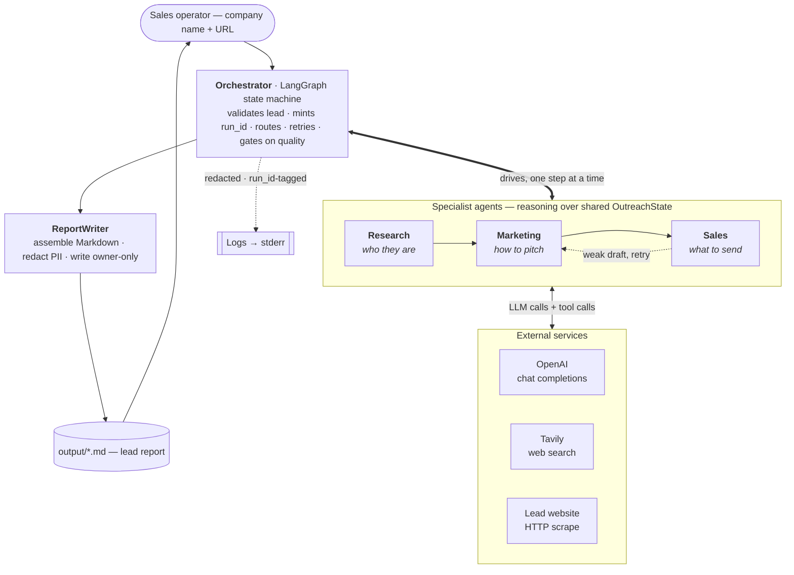
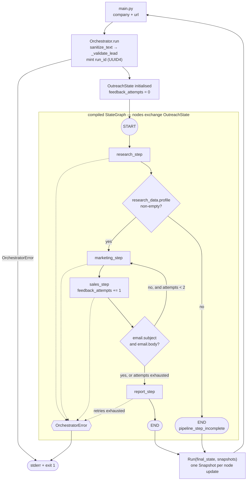
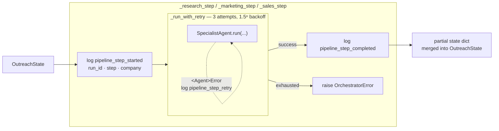
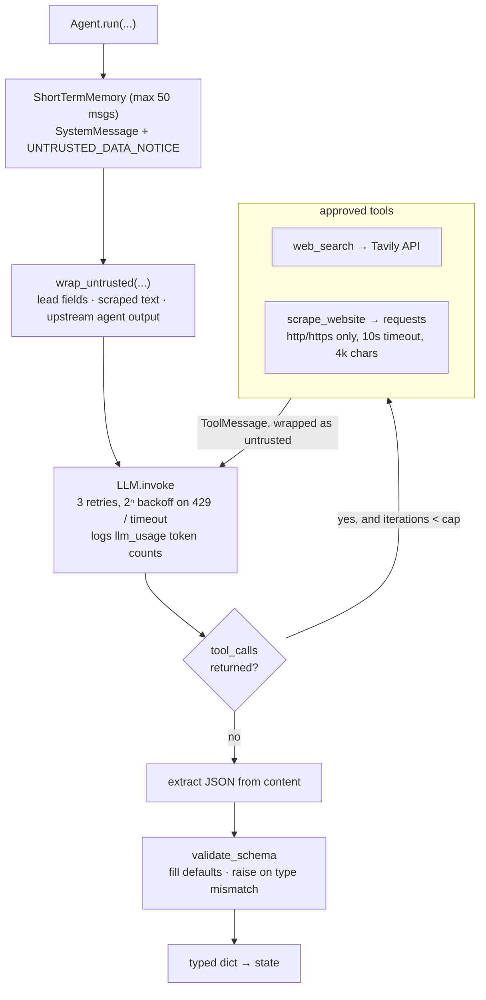
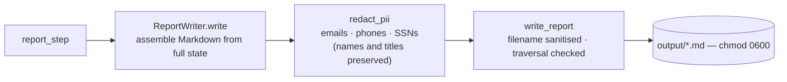
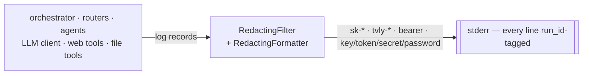

# Architecture

## Overview

One lead in, one Markdown report out. An orchestrator drives three LLM
specialists in sequence over shared typed state, with a quality gate after
research and a feedback loop after sales.

Everything below drills into one band of this picture: the graph the Orchestrator
compiles, what a single node does, what happens inside a specialist, how the
report is written, and how logging cuts across all of it.

## Pipeline topology

Every node reads and writes a single typed `OutreachState` ([`agents/state.py`](../agents/state.py)).
The Orchestrator owns the graph; the specialist agents are pure and know nothing about it.

The sales→marketing edge is the only cycle in the graph. It is bounded by
`_MAX_FEEDBACK_ATTEMPTS` (2), counted on `feedback_attempts`, which `sales_step`
increments — so sales runs at most twice before the report is written regardless
of quality.

## Anatomy of a step node

This is where the Orchestrator earns its keep. Each graph node is a thin wrapper
that adds observability, retry, and error translation around an agent that has
none of those concerns.

Retry here covers failures the LLM client cannot see — chiefly a well-formed HTTP
response whose JSON body fails `validate_schema` and might parse on a fresh
attempt. Transport-level failures are retried a layer down, inside `LLM.invoke`.

## Inside a specialist agent

Tool-loop caps differ by agent: `ResearchAgent` 10 iterations with both tools,
`MarketingAgent` 5 with `web_search` only, `SalesAgent` 0 — it has no tools and
reasons solely over the research and marketing dicts it is handed.

All external text crosses a single trust boundary: `wrap_untrusted` fences it in
`<untrusted_data source="...">` tags and strips control characters, while the
system prompt carries `UNTRUSTED_DATA_NOTICE` instructing the model to treat
anything inside those tags as inert data.

## Report and output path

Redaction targets incidental contact identifiers picked up from scraped pages.
Decision-maker names and titles are the point of a lead report and are left intact.

## Logging (cross-cutting)

Redaction runs both as a filter (pre-format) and in the formatter (post-format,
so tracebacks are covered too). Logs record workflow status, run id, retry and
feedback-loop events, and token usage — never prompts, report bodies, tool
payloads, or secrets.

## Flow

1. A sales operator provides a company name and optional website URL.
2. `Orchestrator.run` sanitizes both fields, validates the lead, mints a `run_id`
   (UUID4), and seeds `OutreachState` with it — every subsequent log line for the
   run carries that id.
3. LangGraph runs research. A conditional edge checks `research_data.profile`
   before advancing: an empty profile routes straight to `END`
   (`pipeline_step_incomplete`) rather than feeding unusable data into marketing.
4. On a complete profile, marketing then sales run. A second conditional edge
   checks `email.subject`/`email.body` — if either is blank, control **loops back
   to `marketing_step`** for a fresh strategy, bounded by `_MAX_FEEDBACK_ATTEMPTS`
   (2) so a persistently bad generation cannot loop forever.
5. Each specialist builds its own `ShortTermMemory`, wraps untrusted input, calls
   the LLM and its approved tools, then validates the parsed JSON against a
   declared schema before returning.
6. `ReportWriter` formats the completed state, redacts incidental PII, and
   `write_report` writes it under `output/` with owner-only (`0600`) permissions.
7. `_run_graph` streams node updates, recording a `Snapshot` per node, and returns
   a `Run` carrying the final state and that ordered history back to the CLI.

## Failure modes

- **Soft stop** — research yields no profile; the graph ends early, no report is
  written, and `Run` comes back with `report_path` empty.
- **Hard stop** — a step exhausts its 3 retries; the node raises
  `OrchestratorError`, which propagates out of the graph and exits the CLI with
  status 1.
- **Degraded pass** — sales output stays incomplete after 2 attempts; the report
  is written anyway with whatever fields are populated.

## Boundaries

- `agents/` owns business workflow behavior — the graph, its routers, and the specialists.
- `lib/` owns reusable primitives: messages, memory, tooling, LLM client, schema
  validation, prompt-injection and PII defenses, secure logging, workflow results.
- `tools/` owns external side effects — network fetches and disk writes.
- `tests/` verifies business logic without live API calls.
